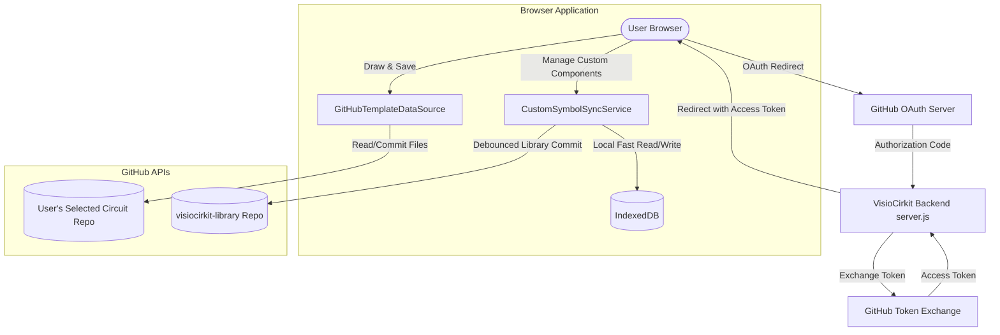

# Design Specification: GitHub Authentication, Git Version Control, and Custom Component Sync

This document details the architectural design for integrating GitHub-based authentication, Git-backed file version control for schematics, and cross-device sync for custom component libraries within VisioCirkit.

---

## 1. Goal Description
The objective is to enable a cloud-friendly, serverless-aligned Web App version of VisioCirkit. Users should be able to:
*   Sign in securely using their GitHub account.
*   Select, create, and version-control circuit drawing directories directly as GitHub repositories.
*   Store and automatically synchronize their custom components library (`customSymbols` and `customCategories`) under a dedicated repository named `visiocirkit-library`.

---

## 2. Architecture Overview

To minimize server-side computational costs and data ownership overhead, the architecture uses a **Client-Side API-driven Model**. 

*   **OAuth Server Gateway**: A lightweight endpoint on the server manages the OAuth authorization code exchange safely without exposing the GitHub Client Secret.
*   **Browser-Based GitHub Client**: Once authenticated, the browser application communicates directly with `api.github.com` using the user's `access_token` via `@octokit/rest` or native fetch.
*   **Git Adapters**: Custom implementations of existing storage adapters (`TemplateDataSource`) redirect local CRUD operations to GitHub commits.
*   **Synchronizer Service**: Synchronizes custom symbols between IndexedDB (local cache) and the `visiocirkit-library` repository in the background.

---

## 3. Component Details

### 3.1 Authentication & Session Management
1.  **OAuth Server Endpoint (`server.js`)**:
    *   `GET /api/auth/github`: Initiates GitHub OAuth authorization, redirecting the browser to `https://github.com/login/oauth/authorize?client_id=CLIENT_ID&scope=repo`.
    *   `GET /api/auth/github/callback`: Receives the query parameters `code` and `state`, validates the `state` cookie, exchanges the code for an access token with GitHub, stores the token in an encrypted HttpOnly session cookie, and redirects the user back to the application homepage without exposing the token to browser JavaScript.
2.  **Session Lifecycle (`AuthService`)**:
    *   Extracts `token` from the URL or reads from `localStorage`.
    *   Validates the token via the `GET /user` endpoint.
    *   Allows the user to log out (clearing the token from local storage).

### 3.2 Git & File Storage Adaptations (`GitHubTemplateDataSource`)
To implement `TemplateDataSource`, the `GitHubTemplateDataSource` maps internal operations to GitHub REST API calls:
*   **`listFiles()`**: Lists files in the selected repository using the GitHub Git Trees or Contents API. Returns `.tex` files found in the root directory under the `works` array.
*   **`readFile(dir, name)`**: Retrieves the base64 content and the `sha` checksum of the specified file.
*   **`saveWork(name, content)`**:
    1.  Prompts the user with a dialog to optionally enter a commit message.
    2.  Sends a `PUT /repos/{owner}/{repo}/contents/{path}` request with the updated content, the file's latest `sha`, and the commit message.
*   **`deleteWork(name)`**: Sends a `DELETE /repos/{owner}/{repo}/contents/{path}` request to delete the file from the remote branch.

### 3.3 Custom Component Library Sync (`CustomSymbolSyncService`)
To sync custom symbol data without affecting UI performance, we combine local IndexedDB storage with background synchronization to `visiocirkit-library`:
1.  **Repository Setup**: When the app detects a GitHub session, it checks for a repository named `visiocirkit-library`. If not found, it creates it via the GitHub API automatically.
2.  **File Hierarchy on GitHub**:
    *   `categories.json`: Contains category structures and symbol orderings.
    *   `symbols/{symbolId}.json`: JSON definition of each custom symbol (XML payload, tikz name, display name, preview SVG).
3.  **Synchronization Strategy**:
    *   **Startup pull**: Fetches `categories.json` and `symbols/*.json` from GitHub. Compares timestamps with local IndexedDB records. Merges records, preferring the latest timestamp (`updatedAt`).
    *   **Save/Delete push**: User edits are instantly written to the local IndexedDB. A background sync job is triggered to write the changes to GitHub. The sync job is debounced (e.g., 3 seconds) to combine multiple consecutive updates into a single commit.

### 3.4 Build Targets and Preset Architecture
To prevent branch divergence and ease porting features, VisioCirkit avoids maintaining separate physical Git branches for each deployment. Instead, the application uses **Runtime Presets** resolved from the HTML meta tag:
*   `server` Preset: Built for local desktop/Electron environment. Uses local node server file storage.
*   `demo` Preset: Built for offline/static browser sandbox. Uses `indexeddb` for drawing storage.
*   `github-vc` Preset: Built for cloud integration. Uses GitHub OAuth login and GitHub API storage.

By defining `github-vc` as a runtime preset in [runtimeBootstrap.ts](file:///c:/Users/iMonet/Projects/antigravity/VisioCirkit/src/scripts/config/runtimeBootstrap.ts), the core code remains unified on `main`. Features developed on `main` automatically propagate to all builds.

---

## 4. Verification Plan

### 4.1 Automated Test Specs
*   **Unit Tests**:
    *   Mock `Octokit` API calls in `tests/githubTemplateDataSource.test.ts` to verify correct mapping of `listFiles`, `readFile`, and `saveWork` parameters.
    *   Test sync resolution logic (conflict detection when local timestamp is newer vs. when remote timestamp is newer).
*   **Integration Tests**:
    *   Verify that backend callback routing exchange functions correctly under mock authorization codes.

### 4.2 Manual Verification
1.  Deploy a development branch locally, configure mock OAuth credentials.
2.  Click "Sign in with GitHub", verify successful redirect and callback exchange.
3.  Choose or create a mock repository, save a new schematic file, and verify the commit history on GitHub.
4.  Create a custom component, wait 3 seconds, and confirm the creation of the matching JSON file in the `visiocirkit-library` repository.
5.  Clear browser cache/local storage, re-log in, and verify that the custom components are downloaded back from GitHub and restored in the component menu.
