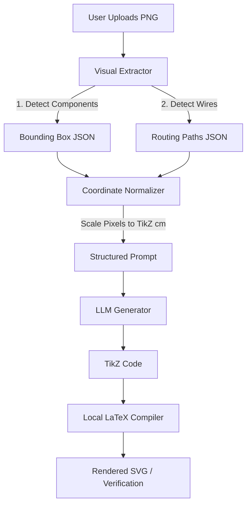

# VisioCirkit 視覺映射架構升級規格書 (方案 A)

> [!NOTE]
> 本規格書針對「視覺映射方案 (Computer Vision + LLM)」進行系統分析與架構設計，旨在解決 LLM 生成 TikZ 程式碼時因缺乏真實 2D 視覺回饋，導致絕對位置失真與佈局不佳的問題。

## 1. 系統部署影響評估 (Deployment Impact)

導入方案 A 會改變後端生成 TikZ 的 Pipeline，但對整體前端與用戶體驗的侵入性極低。

*   **前端部署 (Vercel / Browser)**：**無影響**。前端依然維持上傳原圖 (PNG) 與接收 TikZ/SVG 的機制，不需增加任何計算負擔或變更打包設定。
*   **後端/Agent 部署**：**中度影響**。在 LLM 進行 `sch2tikz` 技能推論前，需插入一道「視覺特徵萃取 (Feature Extraction)」的預處理節點。這會稍微增加單張圖片處理的 Latency (約 0.5 ~ 1.5 秒)，但能大幅減少後續手動微調的時間。
*   **資料庫/儲存**：**低度影響**。除了儲存上傳的 PNG 與生成的 TikZ 外，可選配儲存萃取出的 `bounding_box.json` 以供後續模型微調與除錯使用。

## 2. 硬體需求評估 (Hardware Requirements)

硬體需求取決於我們選擇的「視覺特徵萃取」技術路線。以下提供三種子方案的規格要求：

### 子方案 A1：傳統電腦視覺 (OpenCV)
利用 OpenCV 進行邊緣檢測 (Edge Detection)、輪廓抓取 (Contour Finding) 與模板匹配 (Template Matching)。
*   **運算資源**：極低。
*   **硬體需求**：現有的標準 Server CPU (例如 1 vCPU, 512MB RAM) 即可勝任。
*   **優缺點**：不需要 GPU，部署成本最低；但對於手繪不佳、噪點多的草圖，準確率較低。

### 子方案 A2：輕量級物件偵測模型 (YOLOv8-nano)
訓練一個輕量級模型，專門辨識電路符號 (如 PMOS, NMOS, Inverter, Node) 並輸出精確的 Bounding Box。
*   **運算資源**：中等。
*   **硬體需求**：
    *   **Inference (推論)**：主流 CPU 即可達到即時效能 (約 100-200ms)；若追求極致速度，可搭配基礎 Edge GPU (如 NVIDIA T4 或最低配備的雲端 GPU 實例)。記憶體需求約 1GB - 2GB RAM。
    *   **Training (訓練)**：需準備包含標註資料的 Dataset，並使用具備 GPU 的環境 (如單張 RTX 3060/4090 或 Colab T4) 進行離線訓練。
*   **優缺點**：辨識精準度高，能適應各種手繪與掃描圖片；需要投入初期資料標註與模型訓練成本。

### 子方案 A3：呼叫商業視覺大模型 API (Vision-LLM API)
直接將圖片傳給具備座標輸出能力的 MLLM (例如 GPT-4o 或 Gemini 1.5 Pro)，要求其直接輸出各元件的 Bounding Box 座標。
*   **運算資源**：極低 (全在雲端)。
*   **硬體需求**：無需額外本地硬體。
*   **優缺點**：零硬體建置成本與維護成本；但會增加 API 呼叫的 Token 費用與延遲。

> [!TIP]
> **建議路線**：短期內可採用 **子方案 A3 (API)** 進行 PoC (概念驗證)；若驗證效果優異且有大量並發需求，再轉移至 **子方案 A2 (YOLOv8-nano)** 以降低長期營運成本並提升反應速度。

## 3. 技術架構與運作機制 (Technical Architecture)

將視覺座標整合進 LLM 提示詞 (Prompt) 的具體 Pipeline 如下：



### 3.1 座標正規化 (Coordinate Normalization)
視覺模組抓出的通常是像素座標 (例如 `x: 800, y: 600`)。我們需要一個 Normalizer 腳本，將其轉換為 TikZ 的單位 (cm)：
1.  **設定比例尺**：例如以圖中最寬的兩個元件距離設定為 10cm。
2.  **Y 軸反轉**：圖片的 Y 軸朝下，TikZ 的 Y 軸朝上，必須進行坐標系轉換。
3.  **對齊網格**：將換算後的數值進行四捨五入 (例如 Snap to 0.5cm grid)，確保 TikZ 程式碼乾淨且利於後續手動編輯。

### 3.2 結構化提示詞 (Structured Prompt Design)
注入 LLM 的 Prompt 將不再是讓 LLM「盲猜」，而是給予明確的地圖：
```json
// Example Context provided to LLM
"Detected Components": [
  {"type": "PMOS", "id": "M1", "tikz_coord": "(2.5, 5.5)"},
  {"type": "NMOS", "id": "M3", "tikz_coord": "(2.5, 2.0)"},
  {"type": "Inverter", "id": "INVT1", "tikz_coord": "(4.8, 4.6)"}
]
```

## 4. 實施階段規劃 (Roadmap)

1.  **Phase 1: Proof of Concept (PoC)**
    *   **目標**：驗證絕對座標輸入對 LLM 生成結果的改善程度。
    *   **行動**：使用現有 MLLM API 萃取 Bounding Box，並撰寫簡單的 Python 正規化腳本，手動餵給 LLM 測試。
2.  **Phase 2: Pipeline Integration**
    *   **目標**：自動化視覺映射流程。
    *   **行動**：將腳本整合進 `.agents/skills/sch2tikz/scripts/` 中，成為自動化工作流的第一步。
3.  **Phase 3: Model Optimization (Optional)**
    *   **目標**：降低 API 成本與 Latency。
    *   **行動**：收集用戶上傳的電路圖作為 Dataset，訓練本地的 YOLOv8-nano 模型替換掉 API 呼叫。
